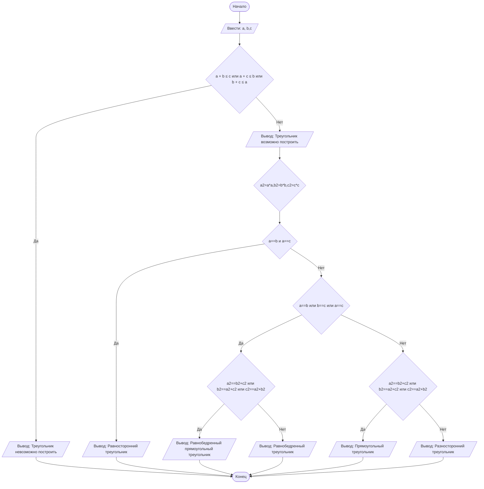

## Отчет по лабораторной работе № 1

#### № группы: `ПМ-2601`

#### Выполнил: `Кокорина Варвара Алексеевна`

#### Вариант: `10`

### Cодержание:

- [Постановка задачи](#1-постановка-задачи)
- [Входные и выходные данные](#2-входные-и-выходные-данные)
- [Выбор структуры данных](#3-выбор-структуры-данных)
- [Алгоритм](#4-алгоритм)
- [Программа](#5-программа)
- [Анализ правильности решения](#6-анализ-правильности-решения)

### 1. Постановка задачи
>Три отрезка длиной A, B и C пытаются образовать треугольник. Проверить, возможно ли составить треугольник из этих отрезков, и если да, то
>определить, какой это треугольник: равносторонний, равнобедренный, разносторонний или прямоугольный. На вход программы подаются натуральные числа A, B, C.

Данную задачу можно разделить на 2 подзадачи: проверить существования треугольника и определить его вид.

- Для 1 подзадачи есть 2 случая:
  1. A<B+C и B<A+C и C<A+B (треугольник существует)
  2. A<B+C или B<A+C или C<A+B (треугольник не существует)
  при 2 случае 2 подзадача не выполняется.
- Для 2 подзадачи есть 5 случаев:
  1.  A=B и B=C (равносторонний)
  2.  A!=B и B!=C и A!=C (разносторонний)
  3.  A=B или A=C или B=C (равнобедренный)
  4.  (A=B или B=C или A=C) и (A2=B2+C2 или B2=A2+C2 или C2=A2+B2) (равнобедренный и прямоугольный)
  5.  A2=B2+C2 или B2=A2+C2 или C2=A2+B2 (прямоугольный) Например,  52=32+42

### 2. Входные и выходные данные

#### Данные на вход

На вход программа должна получать 3 натуральных числа.
|             | Тип                | min значение    | max значение   |
|-------------|--------------------|-----------------|----------------|
| A (Число 1) | Натуральное число | 1  | 109 |
| B (Число 2) | Натуральное число | 1 | 109 |
| C (Число 2) | Натуральное число | 1 | 109 |

#### Данные на выход

Программа должна вывести либо одну строку (треугольник невозможно построить), либо две строки (треугольник возможно построить и его вид).

### 3. Выбор структуры данных

Программа получает 3 натуральных числа, не превышающих 109. Поэтому для их хранения
можно выделить 3 переменных (`a`, `b`, 'c') типа `int`. А также три переменные типа long для хранения квадратов сторон ('a2', 'b2', 'c2').

|             | Название переменной | Тип (в Java) | 
|-------------|---------------------|--------------|
| A (Число 1) | `a`                 | `int`     |
| B (Число 2) | `b`                 | `int`     | 
| C (Число 3) | `c`                 | `int`     | 
| A*A| `a2`                 | `long`     |
| B*B| `b2`                 | `long`     | 
| C*C| `c2`                 | `long`     | 

### 4. Алгоритм

1. **Ввод данных:**
   Программа считывает три натуральных числа, обозначенные как 'a', 'b', 'c'.

3. **Проверить на существование и вывести на экран:**
   Если a + b ≤ c или a + c ≤ b или b + c ≤ a — вывести «Треугольник невозможно построить» и завершить работу. Иначе — вывести «Треугольник возможно построить» и продолжить.

4. **Вычислить квадраты сторон:**
   a2 = a², b2 = b², c2 = c².

5. **Определить тип треугольника и вывести на экран:**
   - Если a==b и a==c, тогда вывести "Равносторонний треугольник".
   - Иначе если a==b или b==c или a==c:
        - Если a2==b2+c2 или b2==a2+c2 или c2==a2+b2, вывести "Равнобедренный прямоугольный треугольник"
        - Иначе вывести "Равнобедренный треугольник"
    - Иначе
        - Если a2==b2+c2 или b2==a2+c2 или c2==a2+b2, вывести "Прямоугольный треугольник".
        - Иначе вывести "Разносторонний треугольник".

#### Блок-схема

