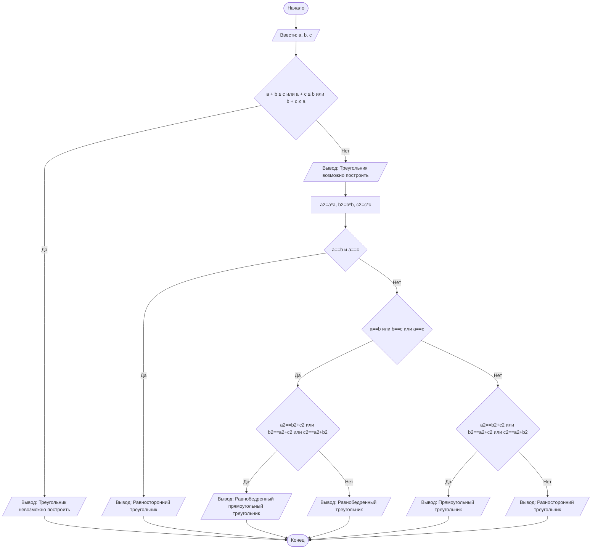

## Отчет по лабораторной работе № 1

#### № группы: `ПМ-2601`

#### Выполнил: `Кокорина Варвара Алексеевна`

#### Вариант: `10`

### Cодержание:

- [Постановка задачи](#1-постановка-задачи)
- [Входные и выходные данные](#2-входные-и-выходные-данные)
- [Выбор структуры данных](#3-выбор-структуры-данных)
- [Алгоритм](#4-алгоритм)
- [Программа](#5-программа)
- [Анализ правильности решения](#6-анализ-правильности-решения)

### 1. Постановка задачи
>Три отрезка длиной A, B и C пытаются образовать треугольник. Проверить, возможно ли составить треугольник из этих отрезков, и если да, то
>определить, какой это треугольник: равносторонний, равнобедренный, разносторонний или прямоугольный. На вход программы подаются натуральные числа A, B, C.

Данную задачу можно разделить на 2 подзадачи: проверить существования треугольника и определить его вид.

- Для 1 подзадачи есть 2 случая:
  1. A<B+C и B<A+C и C<A+B (треугольник существует)
  2. A>=B+C или B>=A+C или C>=A+B (треугольник не существует)
  при 2 случае 2 подзадача не выполняется.
- Для 2 подзадачи есть 5 случаев:
  1.  A=B и B=C (равносторонний)
  2.  A!=B и B!=C и A!=C (разносторонний)
  3.  A=B или A=C или B=C (равнобедренный)
  4.  (A=B или B=C или A=C) и (A<sup>2</sup>=B<sup>2</sup>+C<sup>2</sup> или B<sup>2</sup>=A<sup>2</sup>+C<sup>2</sup> или C<sup>2</sup>=A<sup>2</sup>+B<sup>2</sup>) (равнобедренный и прямоугольный)
  5.  A<sup>2</sup>=B<sup>2</sup>+C<sup>2</sup> или B<sup>2</sup>=A<sup>2</sup>+C<sup>2</sup> или C<sup>2</sup>=A<sup>2</sup>+B<sup>2</sup> (прямоугольный) Например,  5<sup>2</sup>=3<sup>2</sup>+4<sup>2</sup>

### 2. Входные и выходные данные

#### Данные на вход

На вход программа должна получать 3 натуральных числа.
|             | Тип                | min значение    | max значение   |
|-------------|--------------------|-----------------|----------------|
| A (Число 1) | Натуральное число | 1  | 2<sup>31</sup> |
| B (Число 2) | Натуральное число | 1 | 2<sup>31</sup> |
| C (Число 3) | Натуральное число | 1 | 2<sup>31</sup> |

#### Данные на выход

Программа должна вывести либо одну строку (треугольник невозможно построить), либо две строки (треугольник возможно построить и его вид).

### 3. Выбор структуры данных

Программа получает 3 натуральных числа, не превышающих 2<sup>31</sup>. Поэтому для их хранения
можно выделить 3 переменных (`a`, `b`,  `c`) типа `int`. А также три переменные типа long для хранения квадратов сторон ('a2', 'b2', 'c2').

|             | Название переменной | Тип (в Java) | 
|-------------|---------------------|--------------|
| A (Число 1) | `a`                 | `int`     |
| B (Число 2) | `b`                 | `int`     | 
| C (Число 3) | `c`                 | `int`     | 
| A*A| `a2`                 | `long`     |
| B*B| `b2`                 | `long`     | 
| C*C| `c2`                 | `long`     | 

### 4. Алгоритм

1. **Ввод данных:**
   Программа считывает три натуральных числа, обозначенные как `a`, `b`, `c` .

2. **Проверить на существование и вывести на экран:**
   Если a + b ≤ c или a + c ≤ b или b + c ≤ a — вывести «Треугольник невозможно построить» и завершить работу. Иначе — вывести «Треугольник возможно построить» и продолжить.

3. **Вычислить квадраты сторон:**
   a2 = a², b2 = b², c2 = c².

4. **Определить тип треугольника и вывести на экран:**
   - Если a==b и a==c, тогда вывести "Равносторонний треугольник".
   - Иначе если a==b или b==c или a==c:
        - Если a2==b2+c2 или b2==a2+c2 или c2==a2+b2, вывести "Равнобедренный прямоугольный треугольник"
        - Иначе вывести "Равнобедренный треугольник"
    - Иначе
        - Если a2==b2+c2 или b2==a2+c2 или c2==a2+b2, вывести "Прямоугольный треугольник".
        - Иначе вывести "Разносторонний треугольник".

#### Блок-схема

```mermaid
graph TD
    A([Начало]) --> B[/Ввести: a, b, c/]
    B --> C{a + b ≤ c или a + c ≤ b или b + c ≤ a}
    C -- Да --> D[/Вывод: Треугольник невозможно построить/]
    C -- Нет --> E[/Вывод: Треугольник возможно построить/]
    E --> F[a2=a*a, b2=b*b, c2=c*c]
    F --> G{a==b и a==c}
    G -- Да --> H[/Вывод: Равносторонний треугольник/]
    G -- Нет --> I{a==b или b==c или a==c}
    I -- Да --> J{a2==b2+c2 или b2==a2+c2 или c2==a2+b2}
    J -- Да --> K[/Вывод: Равнобедренный прямоугольный треугольник/]
    J -- Нет --> L[/Вывод: Равнобедренный треугольник/]
    I -- Нет --> M{a2==b2+c2 или b2==a2+c2 или c2==a2+b2}
    M -- Да --> N[/Вывод: Прямоугольный треугольник/]
    M -- Нет --> O[/Вывод: Разносторонний треугольник/]
    D --> Z([Конец])
    H --> Z([Конец])
    K --> Z([Конец])
    L --> Z([Конец])
    N --> Z([Конец])
    O --> Z([Конец])
```
### 5. Программа


```java
import java.util.Scanner;

public class Main {
    public static void main(String[] args) {
    
      Scanner scanner = new Scanner(System.in);
      
        // Считываем длины трёх отрезков
        System.out.print("Введите A: ");
        int a = scanner.nextInt();
        System.out.print("Введите B: ");
        int b = scanner.nextInt();
        System.out.print("Введите C: ");
        int c = scanner.nextInt();

        //Проверка существования треугольника
        if (a>=b+c || b>=a+c || c>=a+b) {
          System.out.println("Треугольник невозможно построить");
        } else {
          System.out.println("Треугольник возможно построить");

          //Вычислить квадраты сторон. Формат long, потому что квадрат может превысить int
          long a2=(long) a*a;
          long b2=(long) b*b;
          long c2=(long) c*c;

          //Определить вид треугольника
          if (a==b && b==c) {
            //Все три стороны равны
            System.out.println("Треугольник равносторонний");
          } else if (a==b || b==c || a==c) {
            //Две стороны равны
            if (a2==b2+c2 || b2==a2+c2 || c2==a2+b2) {
              //Удовлетворяет теореме Пифагора
              System.out.println("Треугольник равнобедренный-прямоугольный");
            } else {
              //Не удовлетворяет
              System.out.println("Треугольник равнобедренный");
            }
          } else if (a2==b2+c2 || b2==a2+c2 || c2==a2+b2) {
            //Две стороны не равны, но удовлетворяет теореме Пифагора
            System.out.println("Треугольник прямоугольный");
          } else {
            //Все стороны различны
            System.out.println("Треугольник разносторонний");
          }

        } 
        scanner.close();
    }
}
```
### 6. Анализ правильности решения


1. Тест при невозможности построить треугольник

- Input:
    ```
    20
    15
    40
    ```

- Output:
    ```
    Треугольник невозможно построить
    ```

2. Тест при возможности построить равносторонний треугольник

- Input:
    ```
    5
    5
    5
    ```

- Output:
    ```
    Треугольник возможно построить
    Треугольник равносторонний
    ```
3. Тест при возможности построить разносторонний треугольник

- Input:
    ```
   15
   6
   10
    ```

- Output:
    ```
    Треугольник возможно построить
    Треугольник разносторонний
    ```

4. Тест при возможности построить равнобедренный треугольник

- Input:
    ```
   9
   10
   10
    ```

- Output:
    ```
    Треугольник возможно построить
    Треугольник равнобедренный
    ```

5. Тест при возможности построить прямоугольный треугольник

- Input:
    ```
   3
    4
    5
    ```

- Output:
    ```
    Треугольник возможно построить
    Треугольник прямоугольный
    ```

6. Тест на равнобедренный-прямоугольный треугольник провести нельзя, так как при натуральных числах он не достигается. Но для полноты классификаций треугольников проверка оставлена.


